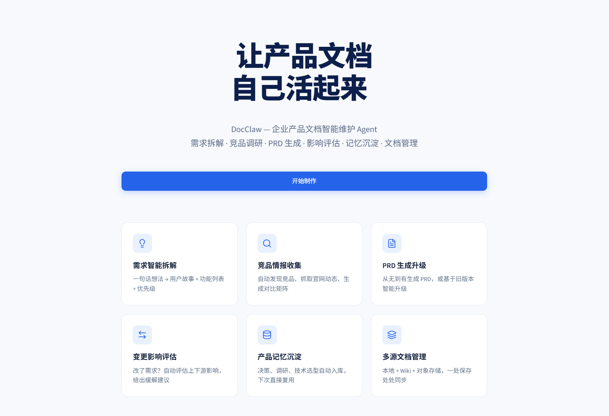

<h1 align="center">DocClaw — 产品文档全生命周期 Agent</h1>

<p align="center">
  
  
  
  
  
  
</p>

<p align="center">
  <a href="https://github.com/thp322"></a>
  <a href="https://docclaw.harperwork.cn/"></a>
</p>

<p align="center">
  <a href="https://docclaw.harperwork.cn/">在线访问</a> |
  <a href="#功能特性">功能特性</a> |
  <a href="#技术栈">技术栈</a> |
  <a href="#项目结构">项目结构</a> |
  <a href="#本地部署">本地部署</a> |
  <a href="#技术特性">技术特性</a>
</p>

<p align="center">
  <a href="https://docclaw.harperwork.cn/"></a>
</p>

**DocClaw —— 企业产品文档智能维护 Agent，让产品文档自己活起来**

围绕产品文档的完整生命周期，DocClaw 提供六大核心能力：需求拆解 · 竞品调研 · PRD 生成 · 影响评估 · 记忆沉淀 · 文档管理

## 功能特性

| 功能 | 说明 | 状态 |
|---|---|---|
| 💡 **需求智能拆解** | 一句话模糊想法 → AI 产品经理多轮追问澄清 → 初级产品描述 → 用户故事 + 功能列表 + 优先级的结构化拆解 | ✅ 已上线 |
| 🔍 **竞品情报收集** | 自动发现竞品、抓取官网动态、生成竞品对比矩阵 | 🚧 持续开发中 |
| 📄 **PRD 生成升级** | 从无到有生成 PRD，或基于旧版本智能增量升级 | 🚧 持续开发中 |
| 🔄 **变更影响评估** | 需求发生变更时，自动评估上下游影响范围并给出缓解建议 | 🚧 持续开发中 |
| 🗄️ **产品记忆沉淀** | 决策、调研、技术选型自动入库，借助向量检索下次直接复用 | 🚧 持续开发中 |
| 📚 **多源文档管理** | 本地 + Wiki + 对象存储，一处保存、处处同步 | 🚧 持续开发中 |

此外已提供**历史记录**能力：每次完成需求拆解自动归档会话快照，支持按时间倒序浏览、查看完整对话详情、一键删除（快照与原始会话文件联动清理）。

## 技术栈

- **语言**：Python 3.10+
- **前端界面**：Streamlit + 自定义 CSS（落地页 / 工作区双套样式，响应式布局）
- **LLM 编排**：LangChain（LCEL 管道、ChatPromptTemplate、RunnableWithMessageHistory、StrOutputParser）
- **大模型**：阿里云百炼 DashScope · 通义千问 `qwen3-max`（对话）、`text-embedding-v4`（向量化）
- **向量数据库**：Chroma（产品记忆 / 知识库检索，规划接入）
- **会话存储**：本地 JSON 文件（LangChain 消息序列化，按 session_id 隔离）
- **数据采集**：HTTP 请求 + HTML 解析（竞品官网动态抓取，规划接入）
- **部署运维**：Docker + Nginx 容器化部署、GitHub Actions CI/CD（规划接入）

## 项目结构

```
DocClaw/
├── frontend/
│   ├── app.py                # Streamlit 主应用：单页路由、落地页、需求拆解、历史记录、联系我们
│   └── styles.py             # 落地页 / 工作区两套 CSS
├── backend/
│   └── RAG/
│       ├── idea_rag.py             # 两阶段对话链：想法澄清 → 需求拆解
│       └── file_history_store.py   # 文件历史存储：会话读写、快照保存/列表/读取/删除
├── public/                   # Logo、favicon、微信二维码、preview.png
├── config_data.py            # 模型名称、Chroma、文档分块等全局配置
├── requirements.txt
└── README.md
```

运行时自动生成 `chat_history/`：

- `chat_history/<session_id>`：每个会话完整的多轮消息文件
- `chat_history/history/时间_功能来源.json`：历史记录页展示的会话快照

## 本地部署

### 1. 创建并激活虚拟环境

```powershell
conda create -n docclaw-main python=3.10
conda activate docclaw-main
```

### 2. 安装依赖

```powershell
pip install -r requirements.txt
```

### 3. 配置 DashScope API Key

前往[阿里云百炼控制台](https://bailian.console.aliyun.com/)获取 API Key：

```powershell
# 当前会话生效
$env:DASHSCOPE_API_KEY="sk-你的APIKey"

# 长期生效（重开终端后可用）
setx DASHSCOPE_API_KEY "sk-你的APIKey"
```

### 4. 启动应用

在**项目根目录**下执行：

```powershell
streamlit run frontend/app.py
```

浏览器访问终端输出的本地地址（默认 `http://localhost:8501`），点击「开始制作」进入工作区，在侧边栏「功能」中体验。

## 技术特性


